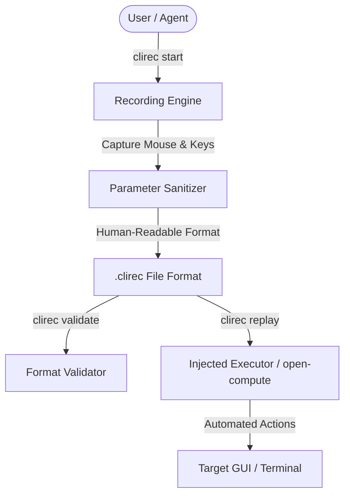

# clirec


[](https://github.com/ellmos-ai/clirec/actions/workflows/tests.yml)
[](https://github.com/ellmos-ai/clirec)
[](https://github.com/ellmos-ai/clirec/actions/workflows/codeql.yml)
[](https://github.com/ellmos-ai/clirec)
[](https://github.com/ellmos-ai)
[](https://github.com/open-bricks)
[](https://opensource.org/licenses/MIT)

[Deutsch](README_de.md) | **English**

> [!NOTE]
> **AI / LLM Integration**: For machine-readable context, LLM search terms, and architecture notes, see [`llms.txt`](./llms.txt).

`clirec` records mouse and keyboard demonstrations as human-readable `.clirec`
files and replays them through an injected executor. It is built for agent and
CLI workflows where a short demonstration is more reliable than a long verbal
description.

> [!NOTE]
> **LLM & Agent-Native Design**: `clirec` format is optimized for AI agents. Plain text inputs are sanitized by default into parameterized placeholders (`${input_1}`) to preserve privacy during replay.

## Architecture & Replay Flow



The core package has no mandatory runtime dependencies. Windows capture uses a ctypes
backend by default; cross-platform capture is available with the optional
`record` extra. Windows UI Automation metadata is an optional `uia` extra.
Microphone capture is off by default and available through the optional
`audio` extra. It requires both `--audio` and `--audio-consent`.

## Install

```bash
pip install clirec
pip install clirec[record]       # optional pynput backend
pip install clirec[uia]          # optional Windows UI metadata
pip install clirec[audio]        # optional sounddevice microphone adapter
```

Until a package release exists, install directly from GitHub:

```bash
pip install git+https://github.com/ellmos-ai/clirec.git
```

## CLI

```bash
clirec start login-flow
clirec start narrated-flow --audio --audio-consent
clirec validate recordings/login-flow.clirec
clirec list --dir recordings
clirec replay recordings/login-flow.clirec --param input_1=value
```

The safe recording default never persists typed text. Each text segment becomes
a parameter such as `${input_1}` and can be supplied during replay with
`--param input_1=value`. `--allow-unmasked-input` is an explicit unsafe opt-in
for recordings whose plaintext has been reviewed before sharing.

Audio is a separate, explicit privacy boundary. It is never captured before
consent, during a pause, after audio stop, or by a hidden daemon. Format v2 keeps
audio and transcripts in relative SHA-256-verified `.clirec.media/` sidecars;
v1 recordings remain readable. Audio and transcripts can be purged separately:

```bash
clirec audio-devices
clirec purge-audio recordings/narrated-flow.clirec
clirec purge-transcript recordings/narrated-flow.clirec
clirec recover recordings
```

Transcription is an opt-in adapter to a canonical external STT module exposing
`transcribe_file(..., persist=False)`. CLIRec does not implement its own STT
engine and does not silently create a second transcript database. Reviewed
episodes and extractor jobs can be exported as JSON for `skill-extractor` or
`workflow-extract`; neither export activates a skill or schedule automatically.

See [format v2](docs/FORMAT_V2.md), [audio privacy](docs/AUDIO_PRIVACY.md), and
[episode review exports](docs/EPISODE_EXPORT.md).

Replay is backend-neutral. Use it from Python with an executor object, or via an
integration such as `open-compute`:

```bash
oc rec replay recordings/login-flow.clirec
```

## Python

```python
from clirec.format import read
from clirec.replay import replay

recording = read("recordings/login-flow.clirec")
report = replay(recording, executor)
```

`executor` must expose `width`, `height`, and `execute(action)`.

## Tests

```bash
python -m pytest -q
python -m ruff check clirec tests
python -m ruff format --check clirec tests
python -m compileall -q clirec tests
```

See [RELEASE_GATE.md](RELEASE_GATE.md) for the current package and platform
verification boundary.
