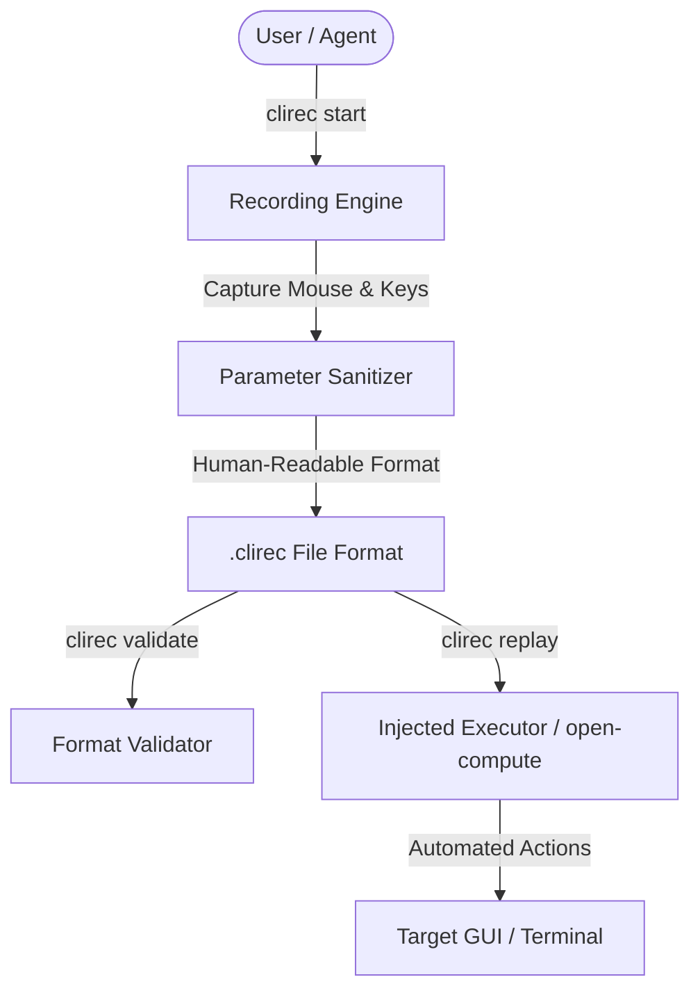

# clirec


<!-- alternate banner: assets/banner-b.png (swap on occasion) -->

[English](README.md) | [Deutsch](README_de.md)

[](https://github.com/ellmos-ai/clirec/actions/workflows/tests.yml)
[](https://github.com/ellmos-ai/clirec/actions/workflows/codeql.yml)
[](tests/)
[](https://github.com/ellmos-ai/clirec)
[](tests/test_metadata.py)
[](THIRD_PARTY_LICENSES.txt)
[](CONTRIBUTING.md)
[](llms.txt)
[](https://github.com/ellmos-ai)
[](https://github.com/open-bricks)
[](LICENSE)
[](NOTICE)

> Human-readable GUI demonstration recordings for CLI and autonomous AI agent workflows.

> [!NOTE]
> **AI / LLM Integration**: For machine-readable context, LLM search queries, and architecture notes, see [`llms.txt`](./llms.txt).

> [!NOTE]
> **LLM & Agent-Native Design**: Typed keyboard text is parameterized by default as placeholders (`${input_1}`). This applies only to typed keyboard text; review UI metadata, optional frames, audio, and other captured content before sharing.

---

## Quick Navigation

1. [Overview](#sec-01)
2. [Key Capabilities](#sec-02)
3. [Target Personas & Discoverability](#sec-03)
4. [Evaluating a Recording or Automation Tool](#sec-04)
5. [Runtime Behavior and Limits](#sec-05)
6. [Architecture & Replay Flow](#sec-06)
7. [Format v2 & SHA-256 Media Sidecars](#sec-07)
8. [Audio Privacy & Consent Boundary](#sec-08)
9. [CLI Workflow & Quickstart](#sec-09)
10. [Python API & Executor Protocol](#sec-10)
11. [Windows Desktop & Agent Environments](#sec-11)
12. [Installation & Optional Extras](#sec-12)
13. [Test Suite & Verification Gates](#sec-13)
14. [Ecosystem & Related Projects](#sec-14)
15. [Third-Party Licenses & Transparency](#sec-15)
16. [Security & Vulnerability Reporting](#sec-16)
17. [Project Context & Discoverability](#sec-17)
18. [License & Maintainers](#sec-18)

---

<a id="sec-01"></a>
<a id="1-overview"></a>
<a id="overview"></a>
<a id="1-uebersicht"></a>
<a id="1-übersicht"></a>
<a id="uebersicht"></a>
<a id="übersicht"></a>
## 1. Overview

`clirec` records mouse and keyboard demonstrations as readable `.clirec` files and replays them through an injected executor. It is intended for workflows that benefit from compact, reviewable event traces, including CLI tools and computer-use agents.

The recorder core has no built-in telemetry and writes to the configured filesystem path. That path may be on synced or network storage, and caller-provided modules or executors may use networks or additional storage. Review those components and outputs before recording or sharing sensitive material.

### ASCII Four-View Architectural Topology

```text
+========================================================================================================================+
|                        CLIREC -- FOUR-VIEW ARCHITECTURAL TOPOLOGY (LOCAL-FIRST & ZERO-EGRESS)                          |
+========================================================================================================================+
| [VIEW 1: CALLER RUNTIMES, CLI AGENTS & HUMAN OPERATOR ENTRYPOINTS]                                                     |
|  * Interactive CLI Commands: clirec start, clirec stop, clirec replay, clirec validate, clirec recover                 |
|  * Autonomous Agent Integration: open-compute (oc rec replay), skill-extractor, LLM computer-use workflows             |
|  * Unprivileged User-Mode Execution [INV-PRIV-08]: Strict RunAsInvoker non-elevation, zero admin/root requirements     |
|  * Human-Readable Action Traces [INV-FMT-03]: Diffable, transparent .clirec format v2 event stream                    |
+------------------------------------------------------------------------------------------------------------------------+
                                                           |
                                                           v
+------------------------------------------------------------------------------------------------------------------------+
| [VIEW 2: RECORDER ENGINE, EVENT SEGMENTATION & PARAMETER SANITIZER]                                                    |
|  * Capture Backends: Low-level native Windows ctypes (zero dependency), optional cross-platform pynput ([record] extra)|
|  * Event Segmentation: Mouse down/up/drag synthesis, wheel scroll coalescing, dead-key / modifier composition        |
|  * Parameter Sanitization [INV-SAN-02]: Typed keyboard text automatically parameterized as ${input_N} placeholders   |
|  * UI Automation Metadata Probing: Optional Windows UIA probe ([uia] extra, uiautomation) for element bounding boxes   |
|  * Audio & Consent Boundary [INV-AUD-07]: Optional PortAudio/sounddevice ([audio]), strict --audio & --audio-consent  |
+------------------------------------------------------------------------------------------------------------------------+
                                                           |
                                                           v
+------------------------------------------------------------------------------------------------------------------------+
| [VIEW 3: RUNTIME PERSISTENCE, SPECIFICATION SERIALIZATION & RECOVERY BOUNDARY]                                         |
|  * Atomic Commit Marker Discipline [INV-REC-05]: Media written first, .clirec manifest published last as commit marker |
|  * SHA-256 Media Sidecars [INV-SHA-04]: Referenced audio (.wav) & transcripts (.txt) in <recording>.clirec.media/      |
|  * Frame Evidence Ringbuffer: Optional caller-injected frame directory (<recording>.clirec.frames/) for validation   |
|  * Failure Recovery: clirec recover removes unreferenced orphan media sidecars; fail-safe rollback on commit errors    |
|  * Local-First Air-Gap [INV-LOCAL-01]: 100% offline filesystem storage, zero telemetry, zero mandatory cloud egress   |
+------------------------------------------------------------------------------------------------------------------------+
                                                           |
                                                           v
+------------------------------------------------------------------------------------------------------------------------+
| [VIEW 4: INJECTED EXECUTOR, REPLAY PROTOCOL & REPRODUCIBLE VALIDATION]                                                 |
|  * Injected Replay Protocol [INV-EXEC-06]: Decoupled replay engine delegating actions to caller-provided BaseExecutor   |
|  * Adaptive Step Execution: Parameter substitution (${key}=value), inter-step timing, virtual desktop coordinates     |
|  * Validation Gates: clirec validate headless schema verification against specification v1/v2                          |
|  * Downstream Learning Pipelines: Episode JSON export for agent fine-tuning and imitation learning workflows            |
|  * Statutory Disclaimer & Response SLA [INV-SLA-10]: Statutory § 521 BGB disclaimer, 48h security response SLA         |
+========================================================================================================================+
```

---

<a id="sec-02"></a>
<a id="2-key-capabilities"></a>
<a id="key-capabilities"></a>
<a id="2-kernfunktionen"></a>
<a id="kernfunktionen"></a>
## 2. Key Capabilities

| Capability | Description |
|---|---|
| **Human-Readable Specification** | Demonstrations stored as transparent, diffable, git-friendly `.clirec` plaintext files. |
| **Typed-Text Parameterization** | Typed keyboard text is represented by parameter placeholders (`${input_1}`) by default; other captured channels are not automatically redacted. |
| **Injected Executor Replay** | Replay is backend-neutral and decoupled from capture mechanics (e.g. via `open-compute` `oc rec replay`). |
| **Format v2 Media Sidecars** | Readers validate referenced media with SHA-256 hashes; the `.clirec` manifest is published last as the commit marker. |
| **Audio Capture** | Synchronous microphone capture is off by default and requires operator opt-in (`--audio` and `--audio-consent`). |
| **STT Adapter** | The caller-selected `--module` receives `persist=False` as a request; clirec cannot enforce the module's storage or network behavior. |
| **Episode & Skill Export** | JSON export for downstream learning workflows (skill-extractor, workflow-extract). |
| **Runtime Dependencies** | The core declares no mandatory runtime dependencies; optional extras are listed in `pyproject.toml`. |
| **Process Permissions** | Runs with the permissions of the process that starts it; it does not itself request elevation. |

---

<a id="sec-03"></a>
<a id="3-target-personas--discoverability"></a>
<a id="target-personas--discoverability"></a>
<a id="3-zielgruppen--auffindbarkeit"></a>
<a id="zielgruppen--auffindbarkeit"></a>
## 3. Target Personas & Discoverability

`clirec` is engineered to solve demonstration and automation challenges for four core personas across the AI and developer ecosystems:

| Persona ID | Target Audience | Primary Need | Key clirec Architectural Solution |
|---|---|---|---|
| `[PERSONA-01]` | **Autonomous AI Agent Engineers & Computer-Use Developers** | Deterministic, token-efficient GUI demonstration traces for training, evaluation, and headless replay without vision-token overhead. | Human-readable `.clirec` step format, automatic parameter sanitization (`${input_1}`), injected executor replay protocol, and JSON episode export for `skill-extractor`. |
| `[PERSONA-02]` | **CLI & Workflow Automation Builders (Sysadmins / DevOps)** | Turn repetitive interactive desktop operations into scriptable CLI commands with parameter injection. | Zero-dependency core CLI (`clirec start`, `clirec replay --param key=val`), headless schema validation (`clirec validate`), and tight `open-compute` integration (`oc rec replay`). |
| `[PERSONA-03]` | **QA, Test Automation & E2E Validation Engineers** | Verifiable, reproducible test demonstration runs that can be checked into Git without binary blob bloat or fragile UI selector breakage. | Git-friendly text spec, optional Windows UI Automation metadata probing (`[uia]`), cryptographic SHA-256 sidecar verification, and cross-platform capture. |
| [PERSONA-04] | **Privacy-Conscious Teams** | Record workflow demonstrations that can be reviewed before sharing. | Typed keyboard text is parameterized by default; review UI metadata, optional frames, and audio for sensitive content before sharing. |

### High-Intent Search Queries

To facilitate discoverability across developer directories, package managers, and search engines:
- desktop interaction recorder with typed-text parameterization — Typed keyboard text is parameterized by default.
- reproducible mouse keyboard action trace `.clirec` format v2 — Readable event files and optional media sidecars.
- agent-native demonstration channel with SHA-256 media sidecars — Readers validate media hashes; the `.clirec` manifest is published last.
- opt-in microphone commentary recording — Audio flags record the operator's opt-in only.
- Windows desktop capture with Python ctypes — Capture uses the permissions of the process that starts it.

---

<a id="sec-04"></a>
<a id="4-comparative-matrix-vs-alternatives"></a>
<a id="comparative-matrix-vs-alternatives"></a>
<a id="4-vergleichsmatrix-gegenueber-alternativen"></a>
<a id="4-vergleichsmatrix-gegenüber-alternativen"></a>
<a id="vergleichsmatrix-gegenueber-alternativen"></a>
<a id="vergleichsmatrix-gegenüber-alternativen"></a>
## 4. Evaluating a Recording or Automation Tool

Use these questions to compare tools for a particular workflow. Verify product-specific behavior against each tool's current documentation and configuration.

| Question | clirec behavior |
|---|---|
| What can be captured? | Mouse and keyboard events; optional UI Automation metadata; optional audio; frames supplied by a caller. |
| Where is it stored? | The recorder writes to the configured filesystem path. Caller-provided modules may use other storage or network services. |
| What is masked? | Typed keyboard text is parameterized by default. UI metadata, optional frames, and audio require separate review. |
| How is media integrity checked? | Format v2 readers validate referenced media against SHA-256 hashes. The `.clirec` manifest is published last; interruptions can leave media sidecars. |
| What does recovery handle? | `clirec recover recordings` removes unreferenced `.clirec.media` sidecars. It does not remove optional `.clirec.frames` directories. |
| How does replay work? | Replay delegates actions to a caller-injected executor. Check the executor's permissions and safety gates separately. |
---

<a id="sec-05"></a>
<a id="5-governance--runtime-invariants"></a>
<a id="governance--runtime-invariants"></a>
<a id="5-governance--laufzeit-invarianten"></a>
<a id="governance--laufzeit-invarianten"></a>
## 5. Runtime Behavior and Limits

- **Storage and network:** The recorder core writes to its configured filesystem path and has no built-in telemetry. Caller-provided modules may use network services or additional storage.
- **Typed input:** Keyboard text is parameterized by default as `input_N` placeholders. This does not redact UI metadata, optional frames, or audio.
- **Readable format:** `.clirec` event files are plaintext and can be inspected with ordinary text tools.
- **Replay:** Replay uses a caller-provided executor; its permissions and behavior are outside the recorder's control.
- **Audio:** Audio is off by default. The flags record the operator's opt-in and do not obtain or verify permission from other people or establish legal compliance.
- **Media sidecars:** The `.clirec` manifest is published last and readers validate referenced media hashes. Recovery removes orphan `.clirec.media` sidecars only; optional frame directories are outside that cleanup.
- **Transcription:** The adapter passes `persist=False` to the selected module. It cannot enforce that module's storage or network behavior.
- **Process permissions:** The application uses the permissions of the process that starts it.
- **Dependencies:** `pyproject.toml` declares no mandatory runtime dependencies; optional extras are listed there.
- **Security response:** The response targets in SECURITY.md depend on maintainer availability and do not guarantee a fix by a particular date.
---

<a id="sec-06"></a>
<a id="6-architecture--replay-flow"></a>
<a id="architecture--replay-flow"></a>
<a id="6-architektur--replay-ablauf"></a>
<a id="architektur--replay-ablauf"></a>
## 6. Architecture & Replay Flow


```mermaid
graph TD
    User(["User / Agent"]) -->|"clirec start"| Recorder["Recording Engine"]
    Recorder -->|"Capture Mouse & Keys"| Param["Parameter Sanitizer"]
    Param -->|"Human-Readable Format"| Spec[".clirec File Format"]
    Spec -->|"clirec validate"| Val["Format Validator"]
    Spec -->|"clirec replay"| Executor["Injected Executor / open-compute"]
    Executor -->|"Automated Actions"| TargetApp["Target GUI / Terminal"]
```

The core package has no mandatory runtime dependencies. Windows capture uses a ctypes backend by default; cross-platform capture is available with the optional `record` extra (`pynput`). Windows UI Automation metadata is an optional `uia` extra (`uiautomation`). Microphone capture is off by default and available through the optional `audio` extra (`sounddevice` + PortAudio). It requires both `--audio` and `--audio-consent`.

---

<a id="sec-07"></a>
<a id="7-format-v2--sha-256-media-sidecars"></a>
<a id="format-v2--sha-256-media-sidecars"></a>
<a id="7-format-v2--sha-256-medien-sidecars"></a>
<a id="format-v2--sha-256-medien-sidecars"></a>
## 7. Format v2 & SHA-256 Media Sidecars

Format v2 stores media such as audio and transcripts in a sibling
`<recording>.clirec.media` directory.

- Readers validate referenced media against SHA-256 hashes in the `.clirec` manifest.
- The recorder publishes the `.clirec` manifest last as the commit marker.
- An interruption can leave unreferenced media sidecars. `clirec recover recordings` removes orphan `.clirec.media` directories; it does not remove optional `.clirec.frames` directories.
- Format v1 recordings remain readable.
---

<a id="sec-08"></a>
<a id="8-audio-privacy--consent-boundary"></a>
<a id="audio-privacy--consent-boundary"></a>
<a id="8-audio-datenschutz--einwilligungsgrenze"></a>
<a id="audio-datenschutz--einwilligungsgrenze"></a>
## 8. Audio Privacy & Consent Boundary

Audio is treated as a distinct, sensitive privacy boundary:
- **Operator opt-in:** Microphone capture requires both `--audio` and `--audio-consent`. These flags record the operator's choice; they do not obtain or verify another person's consent.
- **No Background Recording:** Audio is never captured during pause states, after session completion, or by background daemons.
- **Independent Purge:** Operators can selectively strip audio or transcripts at any time without compromising the underlying GUI action trace:
  ```bash
  clirec purge-audio recordings/narrated-flow.clirec
  clirec purge-transcript recordings/narrated-flow.clirec
  ```
- **Audio and permission:** In Germany, § 201 (1) no. 1 StGB addresses unauthorized recording of another person's non-public speech. The `--audio-consent` flag records the operator's choice; clirec does not obtain or verify other people's permission. See the [official text](https://www.gesetze-im-internet.de/stgb/__201.html).

---

<a id="sec-09"></a>
<a id="9-cli-workflow--quickstart"></a>
<a id="cli-workflow--quickstart"></a>
<a id="9-cli-workflow--schnellstart"></a>
<a id="cli-workflow--schnellstart"></a>
## 9. CLI Workflow & Quickstart

```bash
# Record an interactive demonstration (text masked by default)
clirec start login-flow

# Record a narrated demonstration with audio commentary
clirec start narrated-flow --audio --audio-consent

# Validate recording integrity and schema compliance
clirec validate recordings/login-flow.clirec

# List all available recordings in directory
clirec list --dir recordings

# Replay demonstration with parameterized values
clirec replay recordings/login-flow.clirec --param input_1=secret_value

# Inspect audio devices and purge sidecars
clirec audio-devices
clirec purge-audio recordings/narrated-flow.clirec
clirec purge-transcript recordings/narrated-flow.clirec
clirec recover recordings
```

---

<a id="sec-10"></a>
<a id="10-python-api--executor-protocol"></a>
<a id="python-api--executor-protocol"></a>
<a id="10-python-api--executor-protokoll"></a>
<a id="python-api--executor-protokoll"></a>
## 10. Python API & Executor Protocol

Replay is backend-neutral. Use it directly from Python with any executor adhering to the protocol:

```python
from clirec.format import read
from clirec.replay import replay

# Load and validate demonstration
recording = read("recordings/login-flow.clirec")

# Execute via injected executor (e.g. open-compute or custom actuator)
report = replay(recording, executor, params={"input_1": "test-user"})
print(
    f"Replay completed: {report.successful_steps}/{report.total_steps} steps succeeded"
)
```

The `executor` must implement `width`, `height`, and `execute(action)`.

---

<a id="sec-11"></a>
<a id="11-windows-desktop--agent-environments"></a>
<a id="windows-desktop--agent-environments"></a>
<a id="11-windows-desktop--agent-umgebungen"></a>
<a id="windows-desktop--agent-umgebungen"></a>
## 11. Windows Desktop & Agent Environments

When recording demonstrations on Windows:
- **Interactive Terminal:** `clirec` hooks into the active user session directly via low-level WinAPI hooks (`WH_MOUSE_LL`, `WH_KEYBOARD_LL`).
- **Agent & Daemon Environments:** In background or sandboxed processes, the Windows backend attempts to connect its capture thread to the interactive desktop station (`WinSta0\Default`). Whether capture works depends on process permissions, session and desktop access, and the environment; complete event capture is not guaranteed.

---

<a id="sec-12"></a>
<a id="12-installation--optional-extras"></a>
<a id="installation--optional-extras"></a>
<a id="12-installation--optionale-extras"></a>
<a id="installation--optionale-extras"></a>
## 12. Installation & Optional Extras

Install directly from the Git repository:

```bash
# Core package (pure Python stdlib + ctypes, zero dependencies)
pip install git+https://github.com/ellmos-ai/clirec.git

# Optional extras
pip install "clirec[record] @ git+https://github.com/ellmos-ai/clirec.git"  # pynput cross-platform backend
pip install "clirec[uia] @ git+https://github.com/ellmos-ai/clirec.git"     # Windows UI Automation metadata
pip install "clirec[audio] @ git+https://github.com/ellmos-ai/clirec.git"   # sounddevice microphone capture
pip install "clirec[all] @ git+https://github.com/ellmos-ai/clirec.git"     # All extras combined
```

---

<a id="sec-13"></a>
<a id="13-test-suite--verification-gates"></a>
<a id="test-suite--verification-gates"></a>
<a id="13-testsuite--verifikations-gates"></a>
<a id="testsuite--verifikations-gates"></a>
## 13. Test Suite & Verification Gates

```bash
# Run pytest test suite
python -m pytest -ra -v

# Run code style and linter checks
python -m ruff check clirec tests

# Verify Python bytecode compilation
python -m compileall -q clirec tests
```

See [RELEASE_GATE.md](RELEASE_GATE.md) for package and platform verification boundaries.

---

<a id="sec-14"></a>
<a id="14-ecosystem--related-projects"></a>
<a id="ecosystem--related-projects"></a>
<a id="14-oekosystem--verwandte-projekte"></a>
<a id="14-ökosystem--verwandte-projekte"></a>
<a id="oekosystem--verwandte-projekte"></a>
<a id="ökosystem--verwandte-projekte"></a>
## 14. Ecosystem & Related Projects

`clirec` focuses exclusively on recording, parameterizing, and describing demonstrations. Replay actuation and ecosystem integrations are provided by sibling projects:

| Project | Role in the Ecosystem |
|---|---|
| [open-compute](https://github.com/ellmos-ai/open-compute) | Supplies the physical execution engine that actuates mouse movements and keypresses (`oc rec replay`). |
| [open-compute-mcp](https://github.com/ellmos-ai/open-compute-mcp) | Exposes demonstration replay as the MCP tool `rec_replay`, enabling AI agents to run demonstrations without shell access. |
| [ellmos-voice-io](https://github.com/ellmos-ai/ellmos-voice-io) | STT/TTS primitives that require a caller-supplied wrapper exposing the callable expected by `clirec transcribe`; the module controls its own storage and network behavior. |
| [ellmos](https://github.com/ellmos-ai/ellmos) | The central architectural ecosystem hub coordinating AI agents and desktop automation modules. |
| [open-bricks](https://github.com/open-bricks) | Umbrella organisation for modular, local-first software engineering bricks. |

---

<a id="sec-15"></a>
<a id="15-third-party-licenses--transparency"></a>
<a id="third-party-licenses--transparency"></a>
<a id="15-drittanbieter-lizenzen--transparenz"></a>
<a id="drittanbieter-lizenzen--transparenz"></a>
## 15. Third-Party Licenses & Transparency

The core `clirec` package is licensed under the permissive [MIT License](LICENSE) with **zero mandatory external runtime dependencies**.

Optional extras pull in external open-source packages:
- `pynput` is licensed under **LGPL-3.0**; consult the license text for applicable conditions.
- `sounddevice` and PortAudio are licensed under **MIT**.
- `uiautomation` is licensed under **Apache-2.0**.

For the declared dependency-license inventory and notices, refer to [THIRD_PARTY_LICENSES.md](THIRD_PARTY_LICENSES.md) and its [plain-text companion](THIRD_PARTY_LICENSES.txt).

---

<a id="sec-16"></a>
<a id="16-security--vulnerability-reporting"></a>
<a id="security--vulnerability-reporting"></a>
<a id="16-sicherheit--schwachstellen-meldung"></a>
<a id="sicherheit--schwachstellen-meldung"></a>
## 16. Security & Vulnerability Reporting

- **Reporting:** Use GitHub Private Vulnerability Reporting if it is enabled for this repository. If unavailable, do not post sensitive details publicly; use another private channel only if the project owner has provided one.
- **Response targets:** The policy gives 48-hour initial-response and 5-business-day triage targets, subject to maintainer availability; these do not guarantee a fix by a specific date.
- **Process permissions:** clirec uses the permissions of the process that starts it.
- Full details: [SECURITY.md](SECURITY.md).
---

<a id="sec-17"></a>
<a id="17-directory-listings--ai-discoverability"></a>
<a id="directory-listings--ai-discoverability"></a>
<a id="17-verzeichniseintraege--ki-auffindbarkeit"></a>
<a id="17-verzeichniseinträge--ki-auffindbarkeit"></a>
<a id="verzeichniseintraege--ki-auffindbarkeit"></a>
<a id="verzeichniseinträge--ki-auffindbarkeit"></a>
## 17. Project Context & Discoverability

- **Canonical source:** [ellmos-ai/clirec](https://github.com/ellmos-ai/clirec).
- **LLM context:** This repository includes [llms.txt](llms.txt) for tools that use repository-provided context.
- **External directories:** This README makes no claim that clirec is listed in third-party registries. Add a directory link only after confirming a live listing.
---

<a id="sec-18"></a>
<a id="18-license--maintainers"></a>
<a id="license--maintainers"></a>
<a id="18-lizenz--maintainer"></a>
<a id="lizenz--maintainer"></a>
## 18. License & Maintainers

- **License:** MIT License, see [LICENSE](LICENSE).
- **Attribution & Notice:** See [NOTICE](NOTICE) for canonical copyright and attribution notices.
- **Dependency license information:** See [THIRD_PARTY_LICENSES.txt](THIRD_PARTY_LICENSES.txt) and [THIRD_PARTY_LICENSES.md](THIRD_PARTY_LICENSES.md) for declared dependency and license details.
- **Contributing Guidelines:** See [CONTRIBUTING.md](CONTRIBUTING.md) for development setup and project behavior notes.
- **Maintainers:** The `ellmos-ai` authors & community contributors.
- **Umbrella:** Part of the [open-bricks](https://github.com/open-bricks) open-source software family.
- **Software license:** See [LICENSE](LICENSE) for the MIT License.

