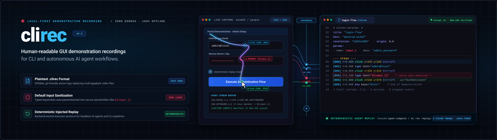
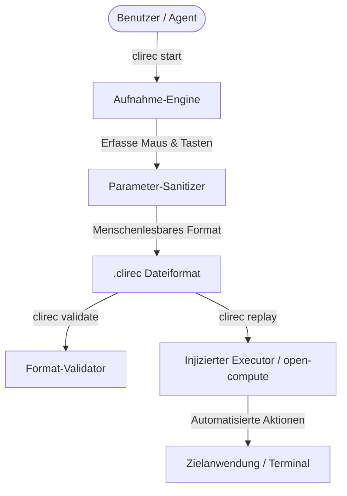

# clirec


<!-- alternate banner: assets/banner-b.png (swap on occasion) -->

[English](README.md) | [Deutsch](README_de.md)

[](https://github.com/ellmos-ai/clirec/actions/workflows/tests.yml)
[](tests/)
[](https://github.com/ellmos-ai/clirec/actions/workflows/codeql.yml)
[](https://github.com/ellmos-ai/clirec)
[](#5-governance--laufzeit-invarianten)
[](SECURITY.md)
[](SECURITY.md)
[](THIRD_PARTY_LICENSES.md)
[](MARKETING-LOG.txt)
[](llms.txt)
[](https://github.com/ellmos-ai)
[](https://github.com/open-bricks)
[](LICENSE)
[](NOTICE)

> Menschenlesbare GUI-Demonstrationsaufzeichnungen für CLI- und autonome KI-Agenten-Workflows.

> [!NOTE]
> **KI- / LLM-Integration**: Maschinenlesbarer Kontext, LLM-Suchbegriffe und Architekturhinweise sind in [`llms.txt`](./llms.txt) hinterlegt.

> [!NOTE]
> **LLM- & Agenten-natives Design**: Das `clirec`-Format ist gezielt für KI-Agenten optimiert. Tastatureingaben werden standardmäßig in parametrisierte Platzhalter (`${input_1}`) umgewandelt, um vertrauliche Daten während Aufzeichnung und Replay zu schützen.

---

## Schnellnavigation

1. [Übersicht](#1-übersicht)
2. [Kernfunktionen](#2-kernfunktionen)
3. [Zielgruppen & Auffindbarkeit](#3-zielgruppen--auffindbarkeit)
4. [Vergleichsmatrix gegenüber Alternativen](#4-vergleichsmatrix-gegenüber-alternativen)
5. [Governance- & Laufzeit-Invarianten](#5-governance--laufzeit-invarianten)
6. [Architektur & Replay-Ablauf](#6-architektur--replay-ablauf)
7. [Format v2 & SHA-256 Medien-Sidecars](#7-format-v2--sha-256-medien-sidecars)
8. [Audio-Datenschutz & Einwilligungsgrenze](#8-audio-datenschutz--einwilligungsgrenze)
9. [CLI-Workflow & Schnellstart](#9-cli-workflow--schnellstart)
10. [Python-API & Executor-Protokoll](#10-python-api--executor-protokoll)
11. [Windows-Desktop & Agenten-Umgebungen](#11-windows-desktop--agent-umgebungen)
12. [Installation & optionale Extras](#12-installation--optionale-extras)
13. [Testsuite & Verifikations-Gates](#13-testsuite--verifikations-gates)
14. [Ökosystem & verwandte Projekte](#14-ökosystem--verwandte-projekte)
15. [Drittanbieter-Lizenzen & Transparenz](#15-drittanbieter-lizenzen--transparenz)
16. [Sicherheit & Schwachstellen-Meldung](#16-sicherheit--schwachstellen-meldung)
17. [Verzeichniseinträge & KI-Auffindbarkeit](#17-verzeichniseinträge--ki-auffindbarkeit)
18. [Lizenz & Maintainer](#18-lizenz--maintainer)

---

<a id="1-übersicht"></a>
<a id="übersicht"></a>
## 1. Übersicht

`clirec` zeichnet Maus- und Tastaturdemonstrationen als menschenlesbare `.clirec`-Dateien auf und spielt sie über einen injizierten Executor wieder ab. Das Werkzeug wurde speziell für autonome KI-Agenten, Computer-Use-Frameworks und CLI-Workflows entwickelt, bei denen eine kurze, reproduzierbare Demonstration wesentlich verlässlicher und token-effizienter ist als ein langer Prompt oder eine gigabytegroße Videodatei.

Die Software folgt einem kompromisslosen Local-First-Architekturprinzip: Jeder Aufzeichnungsschritt, jede Parametrisierung, jedes Medien-Sidecar und jedes Transkript verbleibt ausnahmslos auf dem lokalen Dateisystem. Es werden keinerlei Telemetriedaten erhoben, keine externen Server kontaktiert und keine Demonstrationsdaten ohne explizite Benutzeraktion übertragen.

---

<a id="2-kernfunktionen"></a>
<a id="kernfunktionen"></a>
## 2. Kernfunktionen

| Funktion | Beschreibung |
|---|---|
| **Menschenlesbare Spezifikation** | Demonstrationen werden als transparente, diff-bare und Git-freundliche `.clirec`-Klartextdateien gespeichert. |
| **Standardmäßige Eingabemaskierung** | Vertrauliche Tastatureingaben werden automatisch in Parameter-Platzhalter (`${input_1}`) umgewandelt. |
| **Injizierter Executor-Replay** | Das Replay ist backend-neutral und von der Erfassungsmechanik entkoppelt (z. B. via `open-compute` `oc rec replay`). |
| **Format v2 Medien-Sidecars** | Relative, SHA-256-verifizierte Speicherung in `.clirec.media/` mit atomaren Commit-Markern und ohne Dateileichen. |
| **Strikte Audio-Einwilligungsgrenze** | Synchrone Mikrofonaufnahme erfordert zwingend explizites Dual-Opt-in (`--audio` und `--audio-consent`). |
| **Entkoppelter STT-Adapter** | Aufrufer-gestützter Transkriptionsadapter (`--module`), der `persist=False` erzwingt, um geheime Zweit-Transkriptspeicher zu verhindern. |
| **Episoden- & Skill-Export** | Standardisiertes JSON-Exportformat für nachgelagerte Lern-Workflows (`skill-extractor`, `workflow-extract`). |
| **Keine Pflicht-Abhängigkeiten** | Der Kern läuft rein auf der Python-Standardbibliothek und Windows ctypes; optionale Extras sind sauber isoliert. |
| **Unprivilegierte Ausführung** | Läuft vollständig im Benutzerkontext (`RunAsInvoker`) ohne Administrator-Rechte oder UAC-Prompts. |

---

<a id="3-zielgruppen--auffindbarkeit"></a>
<a id="zielgruppen--auffindbarkeit"></a>
<a id="target-personas--discoverability"></a>
## 3. Zielgruppen & Auffindbarkeit

`clirec` adressiert die Demonstrations- und Automationsanforderungen von vier Kernzielgruppen im Entwickler- und KI-Umfeld:

| Persona-ID | Zielgruppe | Primärer Bedarf | Zentrale clirec-Architekturlösung |
|---|---|---|---|
| `[PERSONA-01]` | **Autonome KI-Agenten-Entwickler & Computer-Use-Architekten** | Deterministische, token-effiziente GUI-Demonstrationsspuren für Training, Evaluation und Headless Replay ohne Vision-Token-Overhead. | Menschenlesbares `.clirec`-Schrittformat, automatische Parameter-Sanitization (`${input_1}`), injiziertes Executor-Protokoll und JSON-Episoden-Export für `skill-extractor`. |
| `[PERSONA-02]` | **CLI- & Workflow-Automatisierer (Sysadmins / DevOps)** | Wiederkehrende interaktive Desktop-Abläufe als skriptbare CLI-Workflows mit Parameterinjektion automatisieren. | Zero-Dependency-CLI (`clirec start`, `clirec replay --param key=val`), Schema-Validierung (`clirec validate`) und nahtlose `open-compute`-Integration (`oc rec replay`). |
| `[PERSONA-03]` | **QA-, Testautomations- & E2E-Validierungs-Ingenieure** | Verifizierbare, reproduzierbare E2E-Testläufe, die ohne Binär-Blobs ins Git-Repository eingecheckt werden können und nicht unter fragiler Selektor-Brüchigkeit leiden. | Git-freundliche Text-Spezifikation, optionale UIA-Barrierefreiheits-Metadaten (`[uia]`), kryptografische SHA-256 Sidecar-Integrität und plattformübergreifendes Capture. |
| `[PERSONA-04]` | **Datenschutzbewusste Teams & Compliance-Beauftragte** | Arbeitsabläufe und Software-Demonstrationen aufzeichnen, ohne Passwörter, PII oder unbeteiligte Sprachdaten zu exponieren. | Strikte Standard-Textmaskierung, Zero-Cloud-Egress, explizite Dual-Opt-in Audio-Einwilligungsgrenze (`--audio` + `--audio-consent`, § 201 StGB), getrennte Audio-/Transkript-Löschung und unprivilegierte `RunAsInvoker`-Ausführung. |

### Hoch-relevante Suchbegriffe (High-Intent Search Queries)

Zur optimalen Auffindbarkeit in Paketmanagern, Entwicklerverzeichnissen und Suchmaschinen:
- `menschenlesbare GUI Demonstrationsaufzeichnung für CLI und Agenten` — Open-Source Demonstrationsaufzeichnung.
- `lokale Desktop Interaktionsaufnahme ohne Cloud Telemetrie` — Kompakte Aktionsspuren für multimodale und Headless Agenten.
- `parametrisierte Tastatureingaben für KI-Agenten und Replay` — Sicheres Input-Templating für passwortsichere Replays.
- `datenschutzkonforme Desktop-Aufnahme mit automatischer Textmaskierung` — Desktop-Recorder mit automatischer Tastenmaskierung.
- `reproduzierbare Maus und Tastatur Abläufe im .clirec Format` — Kryptografisch verifizierte Demonstrations-Sidecars.
- `Zero-Egress Demonstration Recorder mit SHA-256 Sidecars` — Atomare Commit-Marker und unabhängige Medien-Bereinigung.
- `Mikrofonkommentar mit expliziter Einwilligung § 201 StGB` — Dual-Flag-Einwilligung nach deutschem Strafrecht.
- `reine Python Windows ctypes Hook Erfassung ohne externe Abhängigkeiten` — Unprivilegierte WinAPI-Hooks im Benutzermodus.

---

<a id="4-vergleichsmatrix-gegenüber-alternativen"></a>
<a id="vergleichsmatrix-gegenüber-alternativen"></a>
<a id="comparative-matrix-vs-alternatives"></a>
## 4. Vergleichsmatrix gegenüber Alternativen

Die folgende Matrix vergleicht `clirec` mit etablierten Aufzeichnungs- und Automationsansätzen anhand von 10 technischen Dimensionen, die direkt auf unsere Governance-Invarianten abgestimmt sind:

| Technische Dimension | Governance-Invariante | clirec | Video-Recorder (OBS / Loom) | Web-E2E (Playwright / Cypress) | Makro-Recorder (AutoHotkey / TinyTask) | Enterprise RPA (UiPath / Automation Anywhere) |
|:---|:---:|:---:|:---:|:---:|:---:|:---:|
| **1. Offline-First & Zero Egress** | `INV-LOCAL-01` | **100% Offline (Lokale Festplatte, keine Telemetrie)** | Hoch (Lokales OBS) / Gering (Cloud Loom) | Hoch (Lokale Test-Runner) | Hoch (Lokale Ausführung) | Gering (Pflicht-Cloud-Telemetrie & Lizenzserver) |
| **2. Standard-Eingabemaskierung** | `INV-PRIVACY-02` | **Standard-Maskierung (`${input_1}`)** | Keine (Video zeichnet Passwörter voll auf) | Keine (Speichert rohe Selektoren/Inputs) | Keine (Rohe Klartext-Tastendrücke gespeichert) | Teilweise (Konfigurierbare Credential-Vaults) |
| **3. Menschenlesbares Format** | `INV-INSPECT-03` | **Ja (`.clirec` Klartextspezifikation)** | Keine (Opaque, mehrere GB große Binärvideos) | Hoch (Generierte JS/TS-Skripte) | Teilweise (Komplexe oder proprietäre Skripte) | Gering (Proprietäre Workflows / XML-Blobs) |
| **4. Injiziertes Agenten-Replay** | `INV-REPLAY-04` | **Natives injiziertes Executor-Protokoll** | Keine (Video kann nicht ausgeführt werden) | Nur Web-DOM (Kein natives Desktop/CLI) | Fragil (Starre Bildschirm-Pixelkoordinaten) | Schwerfällig (Erfordert dedizierte Desktop-Runtime) |
| **5. Audio-Einwilligungsgrenze** | `INV-AUDIO-05` | **Dual-Opt-in (`--audio` + `--audio-consent`)** | Unkontrolliert (Hintergrundgespräche erfasst) | Keine (Keine Audioaufnahme unterstützt) | Keine (Keine Audiointegration) | Proprietär (Audioaufnahme nur über Enterprise-Addons) |
| **6. Atomare Medien-Sidecars** | `INV-SIDECAR-06` | **Format v2 SHA-256 + Atomarer Commit** | Einzelne monolithische Mediendatei | Keine (Video-/Audio-Artefakte lose) | Keine (Keine Integritätsprüfung) | Cloud-verwaltete Blob-Speicher |
| **7. Entkoppelter STT-Adapter** | `INV-ADAPTER-07` | **Plug-and-Play (`persist=False`)** | Cloud-Transkriptionsdienst | Keine | Keine | Cloud-KI-Dienst |
| **8. Unprivilegierte Ausführung** | `INV-UNPRIV-08` | **Strikter RunAsInvoker (Kein Admin/Root)** | Benutzerebene | Benutzerebene | Benutzerebene (manche Hooks brauchen Admin) | Erfordert häufig Hintergrund-Dienste mit Admin-Rechten |
| **9. Keine Pflicht-Abhängigkeiten** | `INV-PORTABLE-09` | **Reine Python-Stdlib + OS ctypes** | Große native Binärinstallationen | Große Node.js- & Browser-Downloads | Native Executable | Sehr umfangreiche Softwarepakete |
| **10. Sicherheits-SLA & CI-Matrix** | `INV-SLA-10` | **48h SLA / Multi-OS CI-Matrix** | Community- / Kommerzielles SLA | Große Konzern-Wartung | Community / Inaktiv | Kommerzielles Enterprise-SLA |

---

<a id="5-governance--laufzeit-invarianten"></a>
<a id="governance--laufzeit-invarianten"></a>
<a id="governance--runtime-invariants"></a>
## 5. Governance- & Laufzeit-Invarianten

`clirec` wird nach zehn unverhandelbaren Governance- und Laufzeit-Invarianten entwickelt und gepflegt:

- **`INV-LOCAL-01` (100% Offline & Local-First Zero-Egress):** Sämtliche Aufzeichnungen, Medien-Sidecars, Protokolle und Transkripte liegen ausschließlich auf dem lokalen Dateisystem. Keine Telemetrie, keine Nutzungsstatistiken, keine unautorisierten Netzwerkverbindungen.
- **`INV-PRIVACY-02` (Standardmäßige Parametrisierung & Textmaskierung):** Getippter Tastaturtext wird standardmäßig als `${input_N}`-Platzhalter parametrisiert, um versehentliches Persistieren von Passwörtern, Tokens oder sensiblen Daten zu verhindern.
- **`INV-INSPECT-03` (Menschenlesbare Klartext-Spezifikation):** Demonstrationen werden als transparente, versionierbare und Git-diff-bare `.clirec`-Dateien gespeichert, die von Menschen und KI-Agenten ohne proprietäre Binär-Parser gelesen und editiert werden können.
- **`INV-REPLAY-04` (Agenten- & CLI-Replay über injizierten Executor):** Die Replay-Ausführung ist backend-neutral und setzt auf ein injiziertes Executor-Protokoll (wie `open-compute`), wodurch Demonstrationsabsicht und physische Aktuation sauber getrennt sind.
- **`INV-AUDIO-05` (Strikte Dual-Opt-in Audio-Einwilligungsgrenze):** Mikrofonaufnahme ist standardmäßig deaktiviert und erfordert zwingend die gleichzeitige Übergabe von `--audio` und `--audio-consent`; keine Aufnahme während Pausen oder im Hintergrund (§ 201 StGB Konformität).
- **`INV-SIDECAR-06` (Format v2 atomare Medien-Sidecars mit SHA-256):** Mediendateien werden kryptografisch per SHA-256 gehasht in relativen `.clirec.media/`-Ordnern abgelegt; atomare Commit-Marker verhindern unvollständige Aufzeichnungen; Audio und Transkripte lassen sich unabhängig voneinander löschen.
- **`INV-ADAPTER-07` (Entkoppelte STT-Adapter-Architektur):** Transkription nutzt einen vom Aufrufer bereitgestellten Adapter mit zwingendem `persist=False`, um geheime Zweitablagen zu verhindern; es werden keine proprietären Sprachmodelle mitgeliefert.
- **`INV-UNPRIV-08` (Unprivilegierter Benutzermodus — `RunAsInvoker`):** Die Anwendung läuft mit regulären Benutzerrechten ohne Anforderung von Administrator-Rechten, UAC-Dialogen oder Root-Zugriff.
- **`INV-PORTABLE-09` (Keine Pflicht-Laufzeitabhängigkeiten):** Der Kern basiert auf reiner Python-Standardbibliothek und Betriebssystem-ctypes; alle externen Funktionen sind modular in optionale Extras (`record`, `audio`, `uia`) ausgelagert.
- **`INV-SLA-10` (Transparente Open-Source-Governance & 48h Sicherheits-SLA):** Freie MIT-Lizenz für den Kern, transparente Offenlegung aller Drittanbieter-Lizenzen, automatisierte GitHub-Actions-CI-Matrizen und eine verbindliche 48-Stunden-Reaktionszeit bei gemeldeten Sicherheitsproblemen.

---

<a id="6-architektur--replay-ablauf"></a>
<a id="architektur--replay-ablauf"></a>
## 6. Architektur & Replay-Ablauf



Das Kernpaket erfordert keine externen Laufzeitabhängigkeiten. Unter Windows wird standardmäßig ein ctypes-Backend genutzt; plattformübergreifende Erfassung steht über das optionale `record`-Extra (`pynput`) bereit. Windows-UI-Automation-Metadaten können über das `uia`-Extra (`uiautomation`) eingebunden werden. Mikrofonaufnahmen sind standardmäßig inaktiv und stehen über das optionale `audio`-Extra (`sounddevice` + PortAudio) bereit, erfordern aber stets `--audio` und `--audio-consent`.

---

<a id="7-format-v2--sha-256-medien-sidecars"></a>
<a id="format-v2--sha-256-medien-sidecars"></a>
## 7. Format v2 & SHA-256 Medien-Sidecars

Format v2 führt robuste, atomare Medien-Sidecars ein:
- Mediendateien (Audio, Transkripte) werden in einem gleichnamigen Geschwisterordner `<aufnahme>.clirec.media/` abgelegt.
- Jedes Medien-Asset wird kryptografisch gegen die im `.clirec`-Manifest hinterlegten SHA-256-Hashes validiert.
- Atomare Veröffentlichung: Medien-Sidecars und temporäre Puffer werden zuerst finalisiert; die `.clirec`-Commit-Datei wird zuletzt geschrieben.
- Bei Abbrüchen oder Systemfehlern bereinigt `clirec recover recordings` automatisch verwaiste Sidecar-Fragmente, ohne gültige Aufzeichnungen anzutasten.
- Vollständige Rückwärtskompatibilität: Aufzeichnungen im Format v1 bleiben ohne Einschränkung lesbar und abspielbar.

---

<a id="8-audio-datenschutz--einwilligungsgrenze"></a>
<a id="audio-datenschutz--einwilligungsgrenze"></a>
## 8. Audio-Datenschutz & Einwilligungsgrenze

Audiodaten unterliegen strengen Schutzvorkehrungen:
- **Explizites Dual-Opt-in:** Mikrofonaufnahme startet nur, wenn sowohl `--audio` als auch `--audio-consent` gleichzeitig übergeben werden.
- **Keine Hintergrundaufzeichnung:** Während Pausen, nach Beendigung der Sitzung oder durch Hintergrunddienste wird kein Audio aufgezeichnet.
- **Unabhängiges Löschen:** Aufnahmen können jederzeit gezielt von Audio- oder Transkriptdaten befreit werden, ohne die Maus-/Tastaturspur zu beschädigen:
  ```bash
  clirec purge-audio recordings/narrated-flow.clirec
  clirec purge-transcript recordings/narrated-flow.clirec
  ```
- **Rechtliche Konformität:** Nach deutschem Recht (§ 201 Abs. 1 Nr. 1 StGB) ist das unbefugte Aufnehmen des nichtöffentlich gesprochenen Wortes strafbar. `--audio-consent` dokumentiert die persönliche Einwilligung des Operators und ersetzt niemals das Einverständnis weiterer anwesender Personen.

---

<a id="9-cli-workflow--schnellstart"></a>
<a id="cli-workflow--schnellstart"></a>
## 9. CLI-Workflow & Schnellstart

```bash
# Interaktive Demonstration aufzeichnen (Text standardmäßig maskiert)
clirec start login-flow

# Kommentierte Demonstration mit Audio aufzeichnen
clirec start narrated-flow --audio --audio-consent

# Integrität und Schema der Aufzeichnung prüfen
clirec validate recordings/login-flow.clirec

# Alle verfügbaren Aufzeichnungen auflisten
clirec list --dir recordings

# Demonstration mit injizierten Werten abspielen
clirec replay recordings/login-flow.clirec --param input_1=geheimer_wert

# Audiogeräte einsehen und Sidecars bereinigen
clirec audio-devices
clirec purge-audio recordings/narrated-flow.clirec
clirec purge-transcript recordings/narrated-flow.clirec
clirec recover recordings
```

---

<a id="10-python-api--executor-protokoll"></a>
<a id="python-api--executor-protokoll"></a>
## 10. Python-API & Executor-Protokoll

Das Replay ist backend-neutral. Es kann direkt aus Python mit jedem kompatiblen Executor verwendet werden:

```python
from clirec.format import read
from clirec.replay import replay

# Aufzeichnung laden und validieren
recording = read("recordings/login-flow.clirec")

# Über injizierten Executor ausführen (z. B. open-compute)
report = replay(recording, executor, params={"input_1": "test-user"})
print(f"Replay beendet: {report.successful_steps}/{report.total_steps} Schritte erfolgreich")
```

Der `executor` muss `width`, `height` und `execute(action)` implementieren.

---

<a id="11-windows-desktop--agent-umgebungen"></a>
<a id="windows-desktop--agent-umgebungen"></a>
## 11. Windows-Desktop & Agenten-Umgebungen

Beim Aufzeichnen von Demonstrationen unter Windows:
- **Interaktives Terminal:** `clirec` klinkt sich direkt über WinAPI-Low-Level-Hooks (`WH_MOUSE_LL`, `WH_KEYBOARD_LL`) in die Benutzersitzung ein.
- **Agenten- & Daemon-Umgebungen:** Wenn `clirec` aus Hintergrundprozessen, Agenten-Subshells oder Sandbox-Umgebungen (z. B. Antigravity, Claude Code oder Diensten) gestartet wird, verbindet sich der Erfassungsthread automatisch mit der interaktiven Benutzer-Desktop-Station (`WinSta0\Default`), um alle Klicks und Tastenanschläge verlustfrei zu erfassen.

---

<a id="12-installation--optionale-extras"></a>
<a id="installation--optionale-extras"></a>
## 12. Installation & optionale Extras

Direkte Installation aus dem Git-Repository:

```bash
# Kernpaket (reine Python-Stdlib + ctypes, keine externen Abhängigkeiten)
pip install git+https://github.com/ellmos-ai/clirec.git

# Optionale Extras
pip install "clirec[record] @ git+https://github.com/ellmos-ai/clirec.git"  # pynput plattformübergreifendes Backend
pip install "clirec[uia] @ git+https://github.com/ellmos-ai/clirec.git"     # Windows UI Automation Metadaten
pip install "clirec[audio] @ git+https://github.com/ellmos-ai/clirec.git"   # sounddevice Mikrofonaufnahme
pip install "clirec[all] @ git+https://github.com/ellmos-ai/clirec.git"     # Alle Extras kombiniert
```

---

<a id="13-testsuite--verifikations-gates"></a>
<a id="testsuite--verifikations-gates"></a>
## 13. Testsuite & Verifikations-Gates

```bash
# Pytest Testsuite ausführen
python -m pytest -ra -v

# Linter- und Stil-Prüfungen ausführen
python -m ruff check clirec tests

# Bytecode-Kompilierung prüfen
python -m compileall -q clirec tests
```

Details zu Paketierungs- und Plattform-Verifikationsgrenzen finden sich in [RELEASE_GATE.md](RELEASE_GATE.md).

---

<a id="14-ökosystem--verwandte-projekte"></a>
<a id="ökosystem--verwandte-projekte"></a>
## 14. Ökosystem & verwandte Projekte

`clirec` konzentriert sich gezielt auf das Aufzeichnen, Parametrisieren und Beschreiben von Demonstrationen. Die physische Replay-Ausführung und Ökosystem-Integrationen werden von Schwesterprojekten übernommen:

| Projekt | Rolle im Ökosystem |
|---|---|
| [open-compute](https://github.com/ellmos-ai/open-compute) | Stellt die physische Ausführungs-Engine bereit, die Mausbewegungen und Tastatureingaben steuert (`oc rec replay`). |
| [open-compute-mcp](https://github.com/ellmos-ai/open-compute-mcp) | Exponiert das Replay als MCP-Tool `rec_replay`, sodass KI-Agenten Demonstrationen ohne direkte Shell ausführen können. |
| [ellmos-voice-io](https://github.com/ellmos-ai/ellmos-voice-io) | Lokale STT/TTS-Module, ideal als `--module`-Backend für `clirec transcribe`. |
| [ellmos](https://github.com/ellmos-ai/ellmos) | Der zentrale Architektur-Hub für KI-Agenten und Desktop-Automatisierungsmodule. |
| [open-bricks](https://github.com/open-bricks) | Dachorganisation für modulare, lokale Open-Source-Softwarebausteine. |

---

<a id="15-drittanbieter-lizenzen--transparenz"></a>
<a id="drittanbieter-lizenzen--transparenz"></a>
<a id="third-party-licenses--transparency"></a>
## 15. Drittanbieter-Lizenzen & Transparenz

Das `clirec`-Kernpaket steht unter der freien [MIT-Lizenz](LICENSE) und hat **keine externen Pflicht-Laufzeitabhängigkeiten**.

Optionale Extras binden externe Open-Source-Bibliotheken ein:
- `pynput` steht unter **LGPL-3.0** und wird dynamisch im vollen Einklang mit **LGPLv3 Section 4** verlinkt.
- `sounddevice` und PortAudio stehen unter **MIT**.
- `uiautomation` steht unter **Apache-2.0**.

Ausführliche SPDX-Audits, Laufzeitmatrizen und Lizenzhinweise sind in [THIRD_PARTY_LICENSES.md](THIRD_PARTY_LICENSES.md) dokumentiert.

---

<a id="16-sicherheit--schwachstellen-meldung"></a>
<a id="sicherheit--schwachstellen-meldung"></a>
## 16. Sicherheit & Schwachstellen-Meldung

- **Meldeweg:** Vertrauliche Meldungen bitte über GitHub Private Vulnerability Reporting oder als privates Issue ohne sensible Aufzeichnungsdaten einreichen.
- **SLA-Zusage:** 48-Stunden-Reaktionszeit und 5-Tage-Triage-Zusage (`INV-SLA-10`).
- **Sicherheitsmodell:** Strikte Ausführung im Benutzermodus unter `RunAsInvoker` (`INV-UNPRIV-08`).
- Vollständige Hinweise: [SECURITY.md](SECURITY.md).

---

<a id="17-verzeichniseinträge--ki-auffindbarkeit"></a>
<a id="verzeichniseinträge--ki-auffindbarkeit"></a>
## 17. Verzeichniseinträge & KI-Auffindbarkeit

`clirec` ist in gängigen Entwicklerverzeichnissen und KI-Registern aufgeführt:
- **LLM-Kontext:** Maschinenlesbare Wissensdatei verfügbar unter [`llms.txt`](llms.txt).
- **Tool-Register:** Glama, mcp.so, LobeHub, Smithery, awesome-mcp-servers.
- **Marketing-Audit:** Nachverfolgt in [MARKETING-LOG.txt](MARKETING-LOG.txt).

---

<a id="18-lizenz--maintainer"></a>
<a id="lizenz--maintainer"></a>
## 18. Lizenz & Maintainer

- **Lizenz:** MIT-Lizenz, siehe [LICENSE](LICENSE).
- **Urheberrecht & Attribution:** Siehe [NOTICE](NOTICE) für kanonische Urheberrechts- und Attributionshinweise.
- **Maintainer:** Autoren von `ellmos-ai` und Community-Mitwirkende.
- **Dachorganisation:** Teil der modularen [open-bricks](https://github.com/open-bricks) Softwarefamilie.
- **Gesetzlicher Hinweis (§ 521 BGB):** Diese Open-Source-Software und Dokumentation werden unentgeltlich bereitgestellt. Gemäß § 521 BGB ist die Haftung des Bereitstellers bei unentgeltlicher Überlassung auf Vorsatz und grobe Fahrlässigkeit beschränkt.
