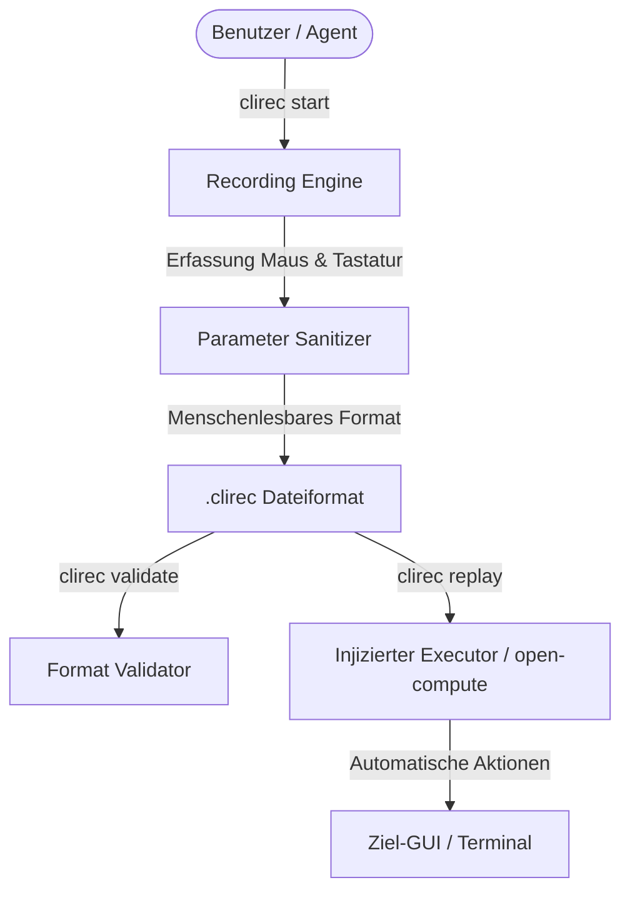

# clirec

[English](README.md) | [Deutsch](README_de.md)

[](https://github.com/ellmos-ai/clirec/actions/workflows/tests.yml)
[](https://github.com/ellmos-ai/clirec)
[](https://github.com/ellmos-ai/clirec/actions/workflows/codeql.yml)
[](https://github.com/ellmos-ai/clirec)
[](https://github.com/ellmos-ai)
[](https://github.com/open-bricks)
[](https://opensource.org/licenses/MIT)

**Deutsch** | [English](README.md)

> [!NOTE]
> **KI / LLM Integration**: Maschinenlesbare Kontexte, LLM-Suchbegriffe und Architektur-Hinweise finden sich in [`llms.txt`](./llms.txt).

`clirec` speichert Maus-/Tastatur-Demonstrationen als menschenlesbare
`.clirec`-Dateien und spielt sie über einen injizierten Executor wieder ab.
Gedacht ist es für Agenten- und CLI-Workflows, bei denen ein kurzer Vormachpfad
zuverlässiger ist als eine lange verbale Beschreibung.

> [!NOTE]
> **LLM- & Agenten-Nativität**: Das `.clirec`-Format ist für KI-Agenten optimiert. Texteingaben werden standardmäßig in parametrisierte Platzhalter (`${input_1}`) umgewandelt, um den Datenschutz beim Teilen und Abspielen zu gewährleisten.

## Architektur & Replay-Ablauf



Der Kern hat keine Laufzeitabhängigkeiten. Unter Windows gibt es standardmäßig
ein ctypes-Capture-Backend; plattformübergreifend kann optional `pynput`
installiert werden. Windows-UIA-Metadaten sind ein separates optionales Extra.

## Installation

```bash
pip install clirec
pip install clirec[record]       # optionales pynput-Backend
pip install clirec[uia]          # optionale Windows UI-Metadaten
```

Bis zur Paketveröffentlichung direkt aus GitHub installieren:

```bash
pip install git+https://github.com/ellmos-ai/clirec.git
```

## CLI

```bash
clirec start login-flow
clirec validate recordings/login-flow.clirec
clirec list --dir recordings
clirec replay recordings/login-flow.clirec --param input_1=Wert
```

Im sicheren Standard wird eingegebener Text nie im Klartext gespeichert. Jeder
Textabschnitt wird zu einem Parameter wie `${input_1}` und beim Replay mit
`--param input_1=Wert` befüllt. `--allow-unmasked-input` ist eine ausdrückliche
unsichere Freigabe; solche Aufnahmen müssen vor dem Teilen geprüft werden.

Replay ist backend-neutral. Aus Python mit einem Executor-Objekt oder über eine
Integration wie `open-compute`:

```bash
oc rec replay recordings/login-flow.clirec
```

## Python

```python
from clirec.format import read
from clirec.replay import replay

recording = read("recordings/login-flow.clirec")
report = replay(recording, executor)
```

`executor` muss `width`, `height` und `execute(action)` bereitstellen.

## Tests

```bash
python -m pytest -q
python -m ruff check clirec tests
python -m ruff format --check clirec tests
python -m compileall -q clirec tests
```

Die aktuelle Paket- und Plattformgrenze steht in [RELEASE_GATE.md](RELEASE_GATE.md).

