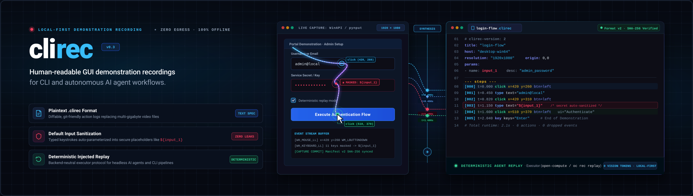
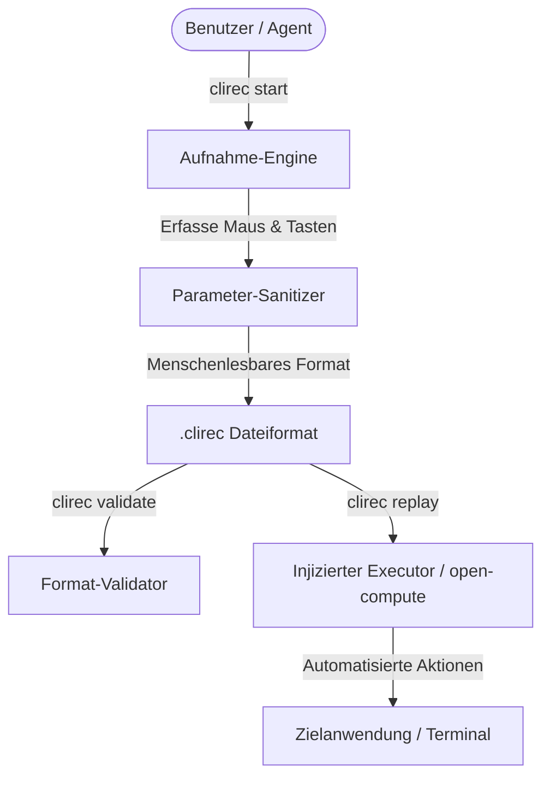

# clirec


<!-- alternate banner: assets/banner-b.png (swap on occasion) -->

[English](README.md) | [Deutsch](README_de.md)

[](https://github.com/ellmos-ai/clirec/actions/workflows/tests.yml)
[](https://github.com/ellmos-ai/clirec/actions/workflows/codeql.yml)
[](https://github.com/ellmos-ai/clirec)
[](llms.txt)
[](https://github.com/ellmos-ai)
[](https://github.com/open-bricks)
[](LICENSE)
[](NOTICE)

> Menschenlesbare GUI-Demonstrationsaufzeichnungen für CLI- und autonome KI-Agenten-Workflows.

> [!NOTE]
> **KI- / LLM-Integration**: Maschinenlesbarer Kontext, LLM-Suchbegriffe und Architekturhinweise sind in [`llms.txt`](./llms.txt) hinterlegt.

> [!NOTE]
> **LLM- & Agenten-natives Design**: Getippter Tastaturtext wird standardmäßig durch Parameter-Platzhalter (`${input_1}`) dargestellt. Das betrifft nur getippten Tastaturtext; prüfe UI-Metadaten, optionale Frames, Audio und weitere erfasste Inhalte vor dem Teilen.

---

## Schnellnavigation

1. [Übersicht](#sec-01)
2. [Kernfunktionen](#sec-02)
3. [Zielgruppen & Auffindbarkeit](#sec-03)
4. [Fragen für den Toolvergleich](#sec-04)
5. [Laufzeitverhalten und Grenzen](#sec-05)
6. [Architektur & Replay-Ablauf](#sec-06)
7. [Format v2 & SHA-256 Medien-Sidecars](#sec-07)
8. [Audio-Datenschutz & Einwilligungsgrenze](#sec-08)
9. [CLI-Workflow & Schnellstart](#sec-09)
10. [Python-API & Executor-Protokoll](#sec-10)
11. [Windows-Desktop & Agenten-Umgebungen](#sec-11)
12. [Installation & optionale Extras](#sec-12)
13. [Testsuite & Verifikations-Gates](#sec-13)
14. [Ökosystem & verwandte Projekte](#sec-14)
15. [Drittanbieter-Lizenzen & Transparenz](#sec-15)
16. [Sicherheit & Schwachstellen-Meldung](#sec-16)
17. [Projektkontext & Auffindbarkeit](#sec-17)
18. [Lizenz & Maintainer](#sec-18)

---

<a id="sec-01"></a>
<a id="1-overview"></a>
<a id="overview"></a>
<a id="1-uebersicht"></a>
<a id="1-übersicht"></a>
<a id="uebersicht"></a>
<a id="übersicht"></a>
## 1. Übersicht

`clirec` zeichnet Maus- und Tastaturdemonstrationen als lesbare `.clirec`-Dateien auf und spielt sie über einen injizierten Executor ab. Es ist für Workflows gedacht, die von kompakten, überprüfbaren Ereignisspuren profitieren, etwa bei CLI-Werkzeugen und Computer-Use-Agenten.

Der Aufzeichnungskern enthält keine eingebaute Telemetrie und schreibt an den konfigurierten Dateisystempfad. Dieser Pfad kann auf synchronisiertem oder vernetztem Speicher liegen; aufrufende Module und Executor können Netzwerk oder zusätzlichen Speicher nutzen. Prüfe diese Komponenten und Ausgaben, bevor du sensible Inhalte aufzeichnest oder teilst.

---

<a id="sec-02"></a>
<a id="2-key-capabilities"></a>
<a id="key-capabilities"></a>
<a id="2-kernfunktionen"></a>
<a id="kernfunktionen"></a>
## 2. Kernfunktionen

| Funktion | Beschreibung |
|---|---|
| **Menschenlesbare Spezifikation** | Demonstrationen werden als transparente, diff-bare und Git-freundliche `.clirec`-Klartextdateien gespeichert. |
| **Parametrisierung von Tastaturtext** | Getippter Tastaturtext wird standardmäßig durch Parameter-Platzhalter (`${input_1}`) dargestellt; andere erfasste Kanäle werden nicht automatisch bereinigt. |
| **Injizierter Executor-Replay** | Das Replay ist backend-neutral und von der Erfassungsmechanik entkoppelt (z. B. via `open-compute` `oc rec replay`). |
| **Format v2 Medien-Sidecars** | Leser prüfen referenzierte Medien per SHA-256; die `.clirec`-Datei wird zuletzt als Commit-Marker veröffentlicht. |
| **Audioaufnahme** | Mikrofonaufnahme ist standardmäßig deaktiviert und erfordert die ausdrückliche Freigabe des Operators (`--audio` und `--audio-consent`). |
| **STT-Adapter** | Das ausgewählte `--module` erhält `persist=False` als Bitte; clirec kann das Speicher- oder Netzwerkverhalten des Moduls nicht erzwingen. |
| **Episoden- & Skill-Export** | JSON-Export für nachgelagerte Lern-Workflows (skill-extractor, workflow-extract). |
| **Laufzeitabhängigkeiten** | Der Kern deklariert keine Pflicht-Laufzeitabhängigkeiten; optionale Extras stehen in `pyproject.toml`. |
| **Prozessberechtigungen** | clirec nutzt die Berechtigungen des startenden Prozesses und fordert selbst keine Erhöhung an. |

---

<a id="sec-03"></a>
<a id="3-target-personas--discoverability"></a>
<a id="target-personas--discoverability"></a>
<a id="3-zielgruppen--auffindbarkeit"></a>
<a id="zielgruppen--auffindbarkeit"></a>
## 3. Zielgruppen & Auffindbarkeit

`clirec` adressiert die Demonstrations- und Automationsanforderungen von vier Kernzielgruppen im Entwickler- und KI-Umfeld:

| Persona-ID | Zielgruppe | Primärer Bedarf | Zentrale clirec-Architekturlösung |
|---|---|---|---|
| `[PERSONA-01]` | **Autonome KI-Agenten-Entwickler & Computer-Use-Architekten** | Deterministische, token-effiziente GUI-Demonstrationsspuren für Training, Evaluation und Headless Replay ohne Vision-Token-Overhead. | Menschenlesbares `.clirec`-Schrittformat, automatische Parameter-Sanitization (`${input_1}`), injiziertes Executor-Protokoll und JSON-Episoden-Export für `skill-extractor`. |
| `[PERSONA-02]` | **CLI- & Workflow-Automatisierer (Sysadmins / DevOps)** | Wiederkehrende interaktive Desktop-Abläufe als skriptbare CLI-Workflows mit Parameterinjektion automatisieren. | Zero-Dependency-CLI (`clirec start`, `clirec replay --param key=val`), Schema-Validierung (`clirec validate`) und nahtlose `open-compute`-Integration (`oc rec replay`). |
| `[PERSONA-03]` | **QA-, Testautomations- & E2E-Validierungs-Ingenieure** | Verifizierbare, reproduzierbare E2E-Testläufe, die ohne Binär-Blobs ins Git-Repository eingecheckt werden können und nicht unter fragiler Selektor-Brüchigkeit leiden. | Git-freundliche Text-Spezifikation, optionale UIA-Barrierefreiheits-Metadaten (`[uia]`), kryptografische SHA-256 Sidecar-Integrität und plattformübergreifendes Capture. |
| [PERSONA-04] | **Datenschutzbewusste Teams** | Arbeitsabläufe aufzeichnen und Aufzeichnungen vor dem Teilen prüfen. | Getippter Tastaturtext wird standardmäßig parametrisiert; UI-Metadaten, optionale Bilder und Audio müssen vor dem Teilen gesondert geprüft werden. |

### Hoch-relevante Suchbegriffe (High-Intent Search Queries)

Zur optimalen Auffindbarkeit in Paketmanagern, Entwicklerverzeichnissen und Suchmaschinen:
- Desktop-Aufnahme mit Parametrisierung getippter Texte — Getippter Tastaturtext wird standardmäßig parametrisiert.
- Reproduzierbare Maus- und Tastaturabläufe im `.clirec`-Format — Lesbare Ereignisdateien und optionale Medien-Sidecars.
- Demonstrationskanal mit SHA-256-Medien-Sidecars — Leser prüfen Medien-Hashes; die `.clirec`-Datei wird zuletzt veröffentlicht.
- Mikrofonkommentar mit Operator-Opt-in — Die Audio-Flags bestätigen nicht die Einwilligung anderer Personen.
- Windows-Desktopaufnahme mit Python ctypes — Die Aufnahme nutzt die Berechtigungen des startenden Prozesses.

---

<a id="sec-04"></a>
<a id="4-comparative-matrix-vs-alternatives"></a>
<a id="comparative-matrix-vs-alternatives"></a>
<a id="4-vergleichsmatrix-gegenueber-alternativen"></a>
<a id="4-vergleichsmatrix-gegenüber-alternativen"></a>
<a id="vergleichsmatrix-gegenueber-alternativen"></a>
<a id="vergleichsmatrix-gegenüber-alternativen"></a>
## 4. Fragen für den Toolvergleich

Mit diesen Fragen lässt sich prüfen, ob ein Aufzeichnungstool zu einem konkreten Arbeitsablauf passt. Produktspezifisches Verhalten sollte anhand der aktuellen Dokumentation und Konfiguration des jeweiligen Tools geprüft werden.

| Frage | Verhalten von clirec |
|---|---|
| Was kann erfasst werden? | Maus- und Tastaturereignisse; optionale UI-Automation-Metadaten; optionales Audio; Bilder, die ein Aufrufer bereitstellt. |
| Wo werden Daten gespeichert? | Der Recorder schreibt in den konfigurierten Dateisystempfad. Aufrufer-Module können weitere Speicher oder Netzwerkdienste nutzen. |
| Was wird maskiert? | Getippter Tastaturtext wird standardmäßig parametrisiert. UI-Metadaten, optionale Bilder und Audio müssen gesondert geprüft werden. |
| Wie wird die Medienintegrität geprüft? | Leser prüfen referenzierte Medien anhand ihrer SHA-256-Hashes. Die `.clirec`-Datei wird zuletzt veröffentlicht; Unterbrechungen können Sidecars zurücklassen. |
| Was bereinigt Recovery? | `clirec recover recordings` entfernt nicht referenzierte `.clirec.media`-Sidecars. Optionale `.clirec.frames`-Verzeichnisse werden dabei nicht entfernt. |
| Wie funktioniert Replay? | Replay delegiert Aktionen an einen injizierten Executor. Berechtigungen und Sicherheitsschranken des Executors sind separat zu prüfen. |
---

<a id="sec-05"></a>
<a id="5-governance--runtime-invariants"></a>
<a id="governance--runtime-invariants"></a>
<a id="5-governance--laufzeit-invarianten"></a>
<a id="governance--laufzeit-invarianten"></a>
## 5. Laufzeitverhalten und Grenzen

- **Speicher und Netzwerk:** Der Recorder-Kern schreibt in den konfigurierten Dateisystempfad und enthält keine eingebaute Telemetrie. Aufrufer-Module können Netzwerkzugriffe oder zusätzliche Ablagen ausführen.
- **Getippte Eingaben:** Tastaturtext wird standardmäßig als input_N-Platzhalter parametrisiert. UI-Metadaten, optionale Frames und Audio werden dadurch nicht redigiert.
- **Lesbares Format:** `.clirec`-Ereignisdateien sind Klartext und mit gewöhnlichen Textwerkzeugen prüfbar.
- **Replay:** Replay verwendet einen vom Aufrufer bereitgestellten Executor; dessen Berechtigungen und Verhalten liegen außerhalb der Kontrolle des Recorders.
- **Audio:** Audio ist standardmäßig aus. Die Flags zeichnen das Opt-in des Operators auf; sie holen oder prüfen keine Erlaubnis anderer Personen und bestätigen keine Rechtskonformität.
- **Medien-Sidecars:** Die `.clirec`-Datei wird zuletzt veröffentlicht, und Leser prüfen referenzierte Medien-Hashes. Recovery entfernt nur verwaiste `.clirec.media`-Sidecars; optionale Frame-Verzeichnisse liegen außerhalb dieser Bereinigung.
- **Transkription:** Der Adapter übergibt `persist=False` an das ausgewählte Modul. Er kann dessen Speicher- oder Netzwerkverhalten nicht erzwingen.
- **Prozessberechtigungen:** Die Anwendung nutzt die Berechtigungen des startenden Prozesses.
- **Abhängigkeiten:** `pyproject.toml` deklariert keine verpflichtenden Laufzeitabhängigkeiten. Optionale Extras sind dort aufgeführt.
- **Reaktionszeiten:** Die Ziele in SECURITY.md hängen von der Verfügbarkeit der Maintainer ab und garantieren keine Behebung bis zu einem bestimmten Datum.
---

<a id="sec-06"></a>
<a id="6-architecture--replay-flow"></a>
<a id="architecture--replay-flow"></a>
<a id="6-architektur--replay-ablauf"></a>
<a id="architektur--replay-ablauf"></a>
## 6. Architektur & Replay-Ablauf


```mermaid
graph TD
    User(["Benutzer / Agent"]) -->|"clirec start"| Recorder["Aufnahme-Engine"]
    Recorder -->|"Erfasse Maus & Tasten"| Param["Parameter-Sanitizer"]
    Param -->|"Menschenlesbares Format"| Spec[".clirec Dateiformat"]
    Spec -->|"clirec validate"| Val["Format-Validator"]
    Spec -->|"clirec replay"| Executor["Injizierter Executor / open-compute"]
    Executor -->|"Automatisierte Aktionen"| TargetApp["Zielanwendung / Terminal"]
```

Das Kernpaket erfordert keine externen Laufzeitabhängigkeiten. Unter Windows wird standardmäßig ein ctypes-Backend genutzt; plattformübergreifende Erfassung steht über das optionale `record`-Extra (`pynput`) bereit. Windows-UI-Automation-Metadaten können über das `uia`-Extra (`uiautomation`) eingebunden werden. Mikrofonaufnahmen sind standardmäßig inaktiv und stehen über das optionale `audio`-Extra (`sounddevice` + PortAudio) bereit, erfordern aber stets `--audio` und `--audio-consent`.

---

<a id="sec-07"></a>
<a id="7-format-v2--sha-256-media-sidecars"></a>
<a id="format-v2--sha-256-media-sidecars"></a>
<a id="7-format-v2--sha-256-medien-sidecars"></a>
<a id="format-v2--sha-256-medien-sidecars"></a>
## 7. Format v2 & SHA-256 Medien-Sidecars

Format v2 speichert Mediendateien wie Audio und Transkripte in einem
Geschwisterverzeichnis `<aufnahme>.clirec.media`.

- Leser prüfen referenzierte Medien anhand der SHA-256-Hashes im `.clirec`-Manifest.
- Der Recorder veröffentlicht das `.clirec`-Manifest zuletzt als Commit-Marker.
- Eine Unterbrechung kann nicht referenzierte Medien-Sidecars zurücklassen. `clirec recover recordings` entfernt verwaiste `.clirec.media`-Verzeichnisse, aber keine optionalen `.clirec.frames`-Verzeichnisse.
- Aufzeichnungen im Format v1 bleiben lesbar.
---

<a id="sec-08"></a>
<a id="8-audio-privacy--consent-boundary"></a>
<a id="audio-privacy--consent-boundary"></a>
<a id="8-audio-datenschutz--einwilligungsgrenze"></a>
<a id="audio-datenschutz--einwilligungsgrenze"></a>
## 8. Audio-Datenschutz & Einwilligungsgrenze

Audiodaten unterliegen strengen Schutzvorkehrungen:
- **Opt-in des Operators:** Für die Mikrofonaufnahme müssen `--audio` und `--audio-consent` übergeben werden. Diese Flags dokumentieren die Entscheidung des Operators; sie holen oder prüfen keine Einwilligung anderer Personen.
- **Keine Hintergrundaufzeichnung:** Während Pausen, nach Beendigung der Sitzung oder durch Hintergrunddienste wird kein Audio aufgezeichnet.
- **Unabhängiges Löschen:** Aufnahmen können jederzeit gezielt von Audio- oder Transkriptdaten befreit werden, ohne die Maus-/Tastaturspur zu beschädigen:
  ```bash
  clirec purge-audio recordings/narrated-flow.clirec
  clirec purge-transcript recordings/narrated-flow.clirec
  ```
- **Audio und Einwilligung:** In Deutschland betrifft § 201 Abs. 1 Nr. 1 StGB das unbefugte Aufnehmen des nichtöffentlich gesprochenen Wortes einer anderen Person. `--audio-consent` dokumentiert die Entscheidung des Operators; clirec holt oder prüft keine Erlaubnis anderer Personen. Siehe den [amtlichen Text](https://www.gesetze-im-internet.de/stgb/__201.html).

---

<a id="sec-09"></a>
<a id="9-cli-workflow--quickstart"></a>
<a id="cli-workflow--quickstart"></a>
<a id="9-cli-workflow--schnellstart"></a>
<a id="cli-workflow--schnellstart"></a>
## 9. CLI-Workflow & Schnellstart

```bash
# Interaktive Demonstration aufzeichnen (Text standardmäßig maskiert)
clirec start login-flow

# Kommentierte Demonstration mit Audio aufzeichnen
clirec start narrated-flow --audio --audio-consent

# Integrität und Schema der Aufzeichnung prüfen
clirec validate recordings/login-flow.clirec

# Alle verfügbaren Aufzeichnungen auflisten
clirec list --dir recordings

# Demonstration mit injizierten Werten abspielen
clirec replay recordings/login-flow.clirec --param input_1=geheimer_wert

# Audiogeräte einsehen und Sidecars bereinigen
clirec audio-devices
clirec purge-audio recordings/narrated-flow.clirec
clirec purge-transcript recordings/narrated-flow.clirec
clirec recover recordings
```

---

<a id="sec-10"></a>
<a id="10-python-api--executor-protocol"></a>
<a id="python-api--executor-protocol"></a>
<a id="10-python-api--executor-protokoll"></a>
<a id="python-api--executor-protokoll"></a>
## 10. Python-API & Executor-Protokoll

Das Replay ist backend-neutral. Es kann direkt aus Python mit jedem kompatiblen Executor verwendet werden:

```python
from clirec.format import read
from clirec.replay import replay

# Aufzeichnung laden und validieren
recording = read("recordings/login-flow.clirec")

# Über injizierten Executor ausführen (z. B. open-compute)
report = replay(recording, executor, params={"input_1": "test-user"})
print(
    f"Replay beendet: {report.successful_steps}/{report.total_steps} Schritte erfolgreich"
)
```

Der `executor` muss `width`, `height` und `execute(action)` implementieren.

---

<a id="sec-11"></a>
<a id="11-windows-desktop--agent-environments"></a>
<a id="windows-desktop--agent-environments"></a>
<a id="11-windows-desktop--agent-umgebungen"></a>
<a id="windows-desktop--agent-umgebungen"></a>
## 11. Windows-Desktop & Agenten-Umgebungen

Beim Aufzeichnen von Demonstrationen unter Windows:
- **Interaktives Terminal:** `clirec` klinkt sich direkt über WinAPI-Low-Level-Hooks (`WH_MOUSE_LL`, `WH_KEYBOARD_LL`) in die Benutzersitzung ein.
- **Agenten- & Daemon-Umgebungen:** In Hintergrund- oder Sandbox-Prozessen versucht das Windows-Backend, den Erfassungsthread mit der interaktiven Desktop-Station (`WinSta0\Default`) zu verbinden. Ob die Erfassung funktioniert, hängt von Prozessberechtigungen, Sitzung, Desktopzugriff und Umgebung ab; eine vollständige Erfassung aller Ereignisse ist nicht garantiert.

---

<a id="sec-12"></a>
<a id="12-installation--optional-extras"></a>
<a id="installation--optional-extras"></a>
<a id="12-installation--optionale-extras"></a>
<a id="installation--optionale-extras"></a>
## 12. Installation & optionale Extras

Direkte Installation aus dem Git-Repository:

```bash
# Kernpaket (reine Python-Stdlib + ctypes, keine externen Abhängigkeiten)
pip install git+https://github.com/ellmos-ai/clirec.git

# Optionale Extras
pip install "clirec[record] @ git+https://github.com/ellmos-ai/clirec.git"  # pynput plattformübergreifendes Backend
pip install "clirec[uia] @ git+https://github.com/ellmos-ai/clirec.git"     # Windows UI Automation Metadaten
pip install "clirec[audio] @ git+https://github.com/ellmos-ai/clirec.git"   # sounddevice Mikrofonaufnahme
pip install "clirec[all] @ git+https://github.com/ellmos-ai/clirec.git"     # Alle Extras kombiniert
```

---

<a id="sec-13"></a>
<a id="13-test-suite--verification-gates"></a>
<a id="test-suite--verification-gates"></a>
<a id="13-testsuite--verifikations-gates"></a>
<a id="testsuite--verifikations-gates"></a>
## 13. Testsuite & Verifikations-Gates

```bash
# Pytest Testsuite ausführen
python -m pytest -ra -v

# Linter- und Stil-Prüfungen ausführen
python -m ruff check clirec tests

# Bytecode-Kompilierung prüfen
python -m compileall -q clirec tests
```

Details zu Paketierungs- und Plattform-Verifikationsgrenzen finden sich in [RELEASE_GATE.md](RELEASE_GATE.md).

---

<a id="sec-14"></a>
<a id="14-ecosystem--related-projects"></a>
<a id="ecosystem--related-projects"></a>
<a id="14-oekosystem--verwandte-projekte"></a>
<a id="14-ökosystem--verwandte-projekte"></a>
<a id="oekosystem--verwandte-projekte"></a>
<a id="ökosystem--verwandte-projekte"></a>
## 14. Ökosystem & verwandte Projekte

`clirec` konzentriert sich gezielt auf das Aufzeichnen, Parametrisieren und Beschreiben von Demonstrationen. Die physische Replay-Ausführung und Ökosystem-Integrationen werden von Schwesterprojekten übernommen:

| Projekt | Rolle im Ökosystem |
|---|---|
| [open-compute](https://github.com/ellmos-ai/open-compute) | Stellt die physische Ausführungs-Engine bereit, die Mausbewegungen und Tastatureingaben steuert (`oc rec replay`). |
| [open-compute-mcp](https://github.com/ellmos-ai/open-compute-mcp) | Exponiert das Replay als MCP-Tool `rec_replay`, sodass KI-Agenten Demonstrationen ohne direkte Shell ausführen können. |
| [ellmos-voice-io](https://github.com/ellmos-ai/ellmos-voice-io) | STT/TTS-Bausteine, die einen vom Aufrufer bereitgestellten Wrapper benötigen, der die von `clirec transcribe` erwartete Funktion anbietet; das Modul steuert sein eigenes Speicher- und Netzwerkverhalten. |
| [ellmos](https://github.com/ellmos-ai/ellmos) | Der zentrale Architektur-Hub für KI-Agenten und Desktop-Automatisierungsmodule. |
| [open-bricks](https://github.com/open-bricks) | Dachorganisation für modulare, lokale Open-Source-Softwarebausteine. |

---

<a id="sec-15"></a>
<a id="15-third-party-licenses--transparency"></a>
<a id="third-party-licenses--transparency"></a>
<a id="15-drittanbieter-lizenzen--transparenz"></a>
<a id="drittanbieter-lizenzen--transparenz"></a>
## 15. Drittanbieter-Lizenzen & Transparenz

Das `clirec`-Kernpaket steht unter der freien [MIT-Lizenz](LICENSE) und hat **keine externen Pflicht-Laufzeitabhängigkeiten**.

Optionale Extras binden externe Open-Source-Bibliotheken ein:
- `pynput` steht unter **LGPL-3.0**; maßgeblich ist der Lizenztext.
- `sounddevice` und PortAudio stehen unter **MIT**.
- `uiautomation` steht unter **Apache-2.0**.

Die Lizenzinventare der deklarierten Abhängigkeiten und die Hinweise dazu stehen in [THIRD_PARTY_LICENSES.md](THIRD_PARTY_LICENSES.md) und der Klartextdatei [THIRD_PARTY_LICENSES.txt](THIRD_PARTY_LICENSES.txt).

---

<a id="sec-16"></a>
<a id="16-security--vulnerability-reporting"></a>
<a id="security--vulnerability-reporting"></a>
<a id="16-sicherheit--schwachstellen-meldung"></a>
<a id="sicherheit--schwachstellen-meldung"></a>
## 16. Sicherheit & Schwachstellen-Meldung

- **Meldeweg:** Nutze GitHub Private Vulnerability Reporting, sofern es für dieses Repository aktiviert ist. Falls es nicht verfügbar ist, veröffentliche keine vertraulichen Angaben; verwende einen anderen privaten Kontaktweg nur, wenn der Projektinhaber ihn bereitgestellt hat.
- **Reaktionsziele:** Die Richtlinie nennt Ziele von 48 Stunden bis zur ersten Antwort und fünf Arbeitstagen bis zur Triage, abhängig von der Verfügbarkeit der Maintainer. Eine Behebung bis zu einem bestimmten Datum wird nicht garantiert.
- **Prozessberechtigungen:** clirec nutzt die Berechtigungen des startenden Prozesses.
- Vollständige Hinweise: [SECURITY.md](SECURITY.md).
---

<a id="sec-17"></a>
<a id="17-directory-listings--ai-discoverability"></a>
<a id="directory-listings--ai-discoverability"></a>
<a id="17-verzeichniseintraege--ki-auffindbarkeit"></a>
<a id="17-verzeichniseinträge--ki-auffindbarkeit"></a>
<a id="verzeichniseintraege--ki-auffindbarkeit"></a>
<a id="verzeichniseinträge--ki-auffindbarkeit"></a>
## 17. Projektkontext & Auffindbarkeit

- **Kanonische Quelle:** [ellmos-ai/clirec](https://github.com/ellmos-ai/clirec).
- **LLM-Kontext:** Dieses Repository enthält [llms.txt](llms.txt) für Werkzeuge, die Repository-Kontext verwenden.
- **Externe Verzeichnisse:** Diese README behauptet keine Einträge in Verzeichnissen Dritter. Ein Link wird erst nach Prüfung eines aktuellen Eintrags ergänzt.
---

<a id="sec-18"></a>
<a id="18-license--maintainers"></a>
<a id="license--maintainers"></a>
<a id="18-lizenz--maintainer"></a>
<a id="lizenz--maintainer"></a>
## 18. Lizenz & Maintainer

- **Lizenz:** MIT-Lizenz, siehe [LICENSE](LICENSE).
- **Urheberrecht & Attribution:** Siehe [NOTICE](NOTICE) für kanonische Urheberrechts- und Attributionshinweise.
- **Abhängigkeitslizenzen:** [THIRD_PARTY_LICENSES.txt](THIRD_PARTY_LICENSES.txt) und [THIRD_PARTY_LICENSES.md](THIRD_PARTY_LICENSES.md) führen deklarierte Abhängigkeiten und Lizenzangaben auf.
- **Beitragsrichtlinien:** Siehe [CONTRIBUTING.md](CONTRIBUTING.md) für Entwicklungsumgebung und Hinweise zum Projektverhalten.
- **Maintainer:** Autoren von `ellmos-ai` und Community-Mitwirkende.
- **Dachorganisation:** Teil der modularen [open-bricks](https://github.com/open-bricks) Softwarefamilie.
- **Softwarelizenz:** Die MIT-Lizenz steht in [LICENSE](LICENSE).

